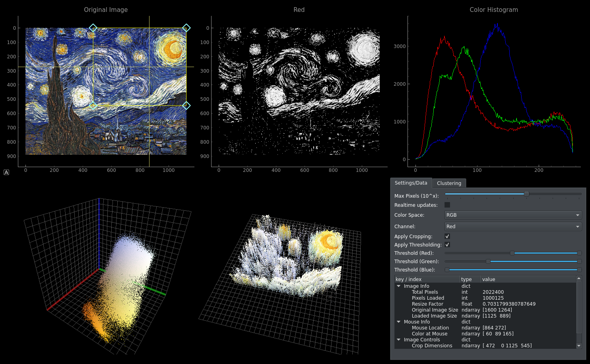

# image-clusterfuck

A Python GUI app for visualizing color distributions on images across various color spaces for image clustering.

## Features
* Supports 7 different color spaces to visualize
* All common image formats supported (JPG, PNG, etc.)
* 3D color space scatterplot for color distribution
* 3D spatial-color scatterplot (X and Y as pixel coordinates and Z as channel value)
* Basic cropping and thresholding supported
* Color/gray histogram visualization
* Color/spatial space clustering w/ visualization using `scikit-learn` (WIP)
* Dataset mode: Open a folder and quickly scroll through images via left/right arrow keys
* Export high quality screenshots of visualizations

## Installation
1. Clone this repo
2. Create conda environment from `.yml` file
3. Run `python main_app.py`

## TODO
* Implement Clustering w/ visualization based on `scikit-learn`: https://scikit-learn.org/stable/modules/clustering.html
* Implement PCA analysis (probably) based on `scikit-learn`